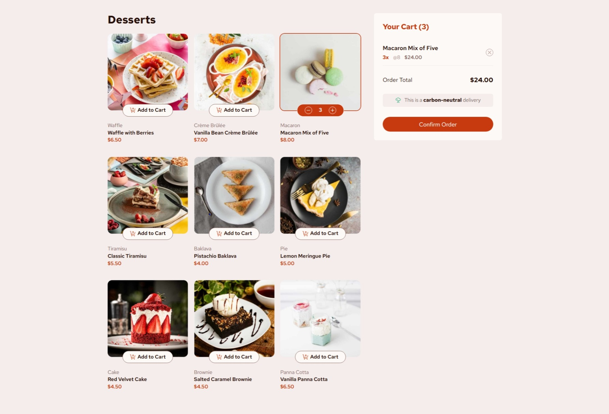

# Frontend Mentor - Product list with cart solution

This is a solution to the [Product list with cart challenge on Frontend Mentor](https://www.frontendmentor.io/challenges/product-list-with-cart-5MmqLVAp_d). Frontend Mentor challenges help you improve your coding skills by building realistic projects.

## Table of contents

- [Overview](#overview)
  - [The challenge](#the-challenge)
  - [Screenshot](#screenshot)
  - [Links](#links)
- [My process](#my-process)
  - [Built with](#built-with)
  - [What I learned](#what-i-learned)
  - [Continued development](#continued-development)
- [Author](#author)

## Overview

### The challenge

Users should be able to:

- Add items to the cart and remove them
- Increase/decrease the number of items in the cart
- See an order confirmation modal when they click "Confirm Order"
- Reset their selections when they click "Start New Order"
- View the optimal layout for the interface depending on their device's screen size
- See hover and focus states for all interactive elements on the page

### Screenshot

### Links

- Solution URL: [https://github.com/uptowngirl757/product-list-w-cart](https://github.com/uptowngirl757/product-list-w-cart)
- Live Site URL: [product-list-w-cart.vercel.app](product-list-w-cart.vercel.app)

## My process

### Built with

- Semantic HTML5 markup
- CSS custom properties
- Flexbox
- CSS Grid
- Mobile-first workflow
- [React](https://reactjs.org/) - JS library

### What I learned

This project gave me valuable practice implementing a shopping cart system and working with modals. I'm particularly glad I had the opportunity to reinforce these concepts in a new context, as repetition across different projects helps solidify my understanding.

### Continued development

I want to deepen my understanding of JavaScript array methods, especially `.find()`. I encountered some challenges using it in this project, so I plan to study array methods more thoroughly to become more confident working with them in future applications.

## Author

- Frontend Mentor - [@uptowngirl757](https://www.frontendmentor.io/profile/uptowngirl757)
